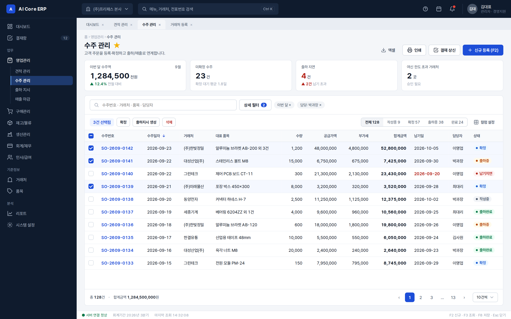

# ERP 표준 UI 규격 v1

업계 통상 ERP(SAP Fiori · Oracle Redwood · MS Dynamics · 더존/영림원 계열) 공통 패턴을 기준으로 한 **ERP 화면 규격**이다.
대표 승인(2026-09-23): 「표준 UI UX 아주 좋아, 지금 만드는 거 이렇게 하라」.

| 파일 | 역할 |
|---|---|
| [`tokens.json`](tokens.json) | **값의 정본** — 색·글자·간격·모서리·골격 치수 76개 |
| [`erp.css`](erp.css) | 공통 스타일. `:root` 는 tokens.json 투영, 나머지는 `erp-*` 컴포넌트 |
| [`main.html`](main.html) | **메인(목록) 화면 템플릿** — 새 목록 화면은 이 파일을 복사해 시작 |
| [`form.html`](form.html) | **등록/수정 폼 템플릿** — 새 입력 화면은 이 파일을 복사해 시작 |
| [`platform/`](platform) | **우리 플랫폼(FreePass ERP) 적용 시안** 5장 — 콕핏·계약진행·계약 상세·재고관리·정산확인 |
| [`themes/`](themes) | **공식 테마 2종** — 등록부 [`themes/index.json`](themes/index.json). 테마 1 `classic`(기본 = tokens.json + erp.css) · 테마 2 `retro`(`retro.json` + `retro.css`) |
| [`images/`](images) | 규격서(`erp-spec.png`)·목록(`erp-main.png`)·폼(`erp-form.png`) 캡처 |
| [`../../scripts/check-erp-standard.mjs`](../../scripts/check-erp-standard.mjs) | 규격 검사 — `npm run erp:check` (npm test 에도 포함) |

---

## 1. 화면 골격 (Shell) — 모든 ERP 화면 공통

| # | 영역 | `data-region` | 규격 |
|---|---|---|---|
| ① | 상단바 | `topbar` | 높이 56 · 로고 · 회사 전환 · 통합검색(Ctrl K) · 도움말/일정/알림 · 사용자 |
| ② | 좌측 메뉴 | `sidenav` | 너비 240 (접힘 64, `data-nav="collapsed"`) · 그룹 › 모듈 › 메뉴 2단 · 현재 메뉴 `aria-current="page"` |
| ③ | 작업 탭 (MDI) | `tabs` | 여러 화면을 탭으로 동시에 연다 · 선택 탭 `aria-selected="true"` |
| ④ | 페이지 헤더 | `page-header` | 경로 · 제목(22/700) · 즐겨찾기 · 설명 · 액션(우측 정렬) |
| ⑤ | 요약 KPI | `kpi` | **선택** · 4열 카드 · 숫자 24/700 · 증감은 ▲▼ + 색 |
| ⑥ | 조회조건 바 | `filter` | 라벨 위 입력 · 필수 `*` · 초기화 · 조회(F3). 검색 위주 화면은 §5-1 검색창 + 상세 필터를 쓸 수 있다 |
| ⑦ | 데이터 그리드 | `grid-toolbar` · `grid` | 선택 건수·일괄 액션 · 상태 탭 · 컬럼 설정 · 합계 · 페이징 |
| ⑧ | 상태바 | `statusbar` | 높이 26 · 서버 연결 · 회계기간 · 마지막 조회 · 단축키 |

본문 여백 좌우 24 / 상하 16 · 섹션 간격 14 · 최소 폭 1280 · 4px 그리드.

## 2. 화면 유형

| 유형 | 템플릿 | 구성 |
|---|---|---|
| 목록(메인) | `main.html` | ④ → ⑤(선택) → [⑥ + ⑦ 한 카드] |
| 등록/수정 폼 | `form.html` | ④(문서 상태 뱃지·전표번호) → 섹션 카드들(4열 폼 그리드, 품목 라인 그리드+합계행) → 하단 고정 저장 줄 `form-footer` |
| 상세 | (다음 단계) | 목록 행 클릭 → 우측 드로어 또는 전체 화면. 폼과 같은 섹션 구성, 읽기 전용 |

## 3. 글자

| 용도 | 토큰 | 크기/굵기 |
|---|---|---|
| KPI 숫자 | `fs-kpi` | 24 / 700 |
| 페이지 제목 | `fs-title` | 22 / 700 |
| 섹션 제목 | `fs-section` | 15 / 700 |
| 본문·셀·버튼 | `fs-body` | 13 / 400 (버튼 600) |
| 라벨·표 헤더·소형 버튼 | `fs-label` | 12 / 500–600 |
| 보조·캡션·상태바 | `fs-caption` | 11.5 / 400 |

- 폰트 Pretendard Variable (한글·영문 한 벌). 숫자는 고정폭(`tabular-nums`).
- 금액·수량은 **오른쪽 정렬**(`erp-num`), 천 단위 콤마. 날짜 `YYYY-MM-DD`. 전표·코드 번호는 링크색.

## 4. 색

- **Primary** `#1D4ED8` — 주요 버튼·링크·선택. **Navigation** `#0F1B2D` — 상단바·좌측 메뉴.
- 면: 바탕 `#F4F6F9` · 카드 `#FFFFFF` · 우묵(조회바·표 헤더) `#F8FAFC`. 선: `#E3E8EF` / 입력 `#CDD5DF`.
- 글자: `#101828` · `#475467` · `#98A2B3`.
- 상태 5종 — 뱃지 `erp-badge--*`

| 상태 | 클래스 | 쓰임 |
|---|---|---|
| 완료·승인 | `--ok` | 출하완료, 결재완료 |
| 확정·진행 | `--info` | 확정, 결재중 |
| 대기·주의 | `--warn` | 출하중, 보류 |
| 반려·지연·오류 | `--err` | 납기지연, 반려 |
| 작성중·임시 | `--neutral` | 작성중, 임시저장 |

상태는 **색 + 점 + 글자**를 함께 쓴다. 색만으로 구분하지 않는다(WCAG 1.4.1).

## 5. 컴포넌트

| 컴포넌트 | 클래스 | 치수 / 규칙 |
|---|---|---|
| 버튼 | `erp-btn` `--primary` `--ghost` `--danger` `--danger-text` `--sm` | 높이 34 (소형 28) · 모서리 6 · 좌우 14 · 아이콘 16. **Primary 는 영역마다 최대 1개, 맨 오른쪽.** 삭제는 확인 대화상자 필수 |
| 입력 | `erp-field` > `erp-label` + `erp-input` | 높이 32 · 모서리 6 · 라벨 위. 포커스 파란 링, 오류 `aria-invalid="true"` + `erp-field-error`, 자동값 `readonly` 회색 |
| 그리드 | `erp-grid` (`--dense`) | 헤더 36 · 행 40 (조밀 32) · 헤더 고정 · hover/선택(`aria-selected`) 행 색 · 합계 `tfoot` |
| 체크박스 | `erp-check` | 16 · 모서리 4 · 일부 선택(indeterminate) 지원 |
| 칩·세그먼트 | `erp-chip` · `erp-seg` | 적용된 조건 칩 · 상태별 건수 탭 (`aria-pressed`) |
| KPI 카드 | `erp-kpi` | 라벨 · 값 · 증감(`erp-up`/`erp-down`) |
| 폼 섹션 | `erp-section` · `erp-form-grid` | 4열 그리드, 넓은 항목 `erp-span-2` / `erp-span-4` |
| 카드 머리 · 2단 배치 | `erp-card-head` · `erp-cols` | 카드 제목 + 링크 / 본문 + 360 보조 패널 |
| 진행 단계 | `erp-steps` | 업무 흐름. 완료 `data-state="done"`, 현재 `aria-current="step"` |
| 처리 대기열 · 값 묶음 · 이력 | `erp-queue` · `erp-props` · `erp-timeline` | 콕핏·상세 화면 ([platform/](platform/README.md) 참고) |

## 5-1. 추가 부품 — 검색창 + 상세 필터 (FreePass Admin, 대표 2026-09-23)

기본 조회조건 바(⑥)는 그대로다. 검색이 먼저인 화면(FreePass Admin)은 같은 자리에 아래 부품을 쓴다.

| 부품 | 클래스 | 쓰임 |
|---|---|---|
| 검색 줄 | `erp-searchbar` · `erp-search` | 검색창 하나 + 적용된 조건 칩(×) |
| 상세 필터 | `erp-filter-more`(`
`) · `erp-filter-panel` · `erp-facet` · `erp-facet-opt` | 조건을 건수 붙은 선택지로 고른다 |
| 분류 드롭다운 | `erp-dd` | 계약 · 정산 · 실적처럼 분류가 필요한 화면에서만 |
| 한 줄 처리 폼 | `erp-inline-form` | 상세의 «처리» 카드 — 값 한 칸 + 단추 |

## 5-2. 추가 부품 — 목록 카드 (FreePass Admin, 대표 2026-09-23)

「목록을 카드 타입으로 … 핸드폰 모바일 버전으로 넘어가기 쉽게」 — 그리드(표) 자리(`data-region="grid"`)에 카드 목록을 둘 수 있다.
카드 칸 수는 넓이에 맞춰 저절로 줄어든다(PC 여러 칸 → 좁은 창 · 폰 한 칸). 같은 마크업이 폰까지 그대로 간다.

| 부품 | 클래스 | 쓰임 |
|---|---|---|
| 카드 목록 | `erp-cardlist` | 그리드 자리. 스크롤 · 칸 나눔 |
| 목록 카드 | `erp-listcard` (`aria-current="true"` = 고른 카드) | 한 건 = 한 장 |
| 머리 | `erp-listcard-head` · `erp-listcard-title` · `erp-listcard-link` · `erp-listcard-sub` | 이름(카드 전체를 덮는 링크) + 보조 줄 · 오른쪽 상태 뱃지 |
| 값 | `erp-props` | 라벨:값 2열 — 표의 열이 여기로 온다 |
| 바닥 | `erp-listcard-foot` · `erp-listcard-amount` | 태그(왼쪽) · 대표 금액(오른쪽) |

합계 · 건수 · 페이지는 카드 목록 아래 `erp-grid-foot` 에 둔다. 상세 안의 작은 표(요금표 · 금액표)는 그리드 그대로다.

## 5-3. 추가 부품 — 긴 카드 목록 (FreePass Admin, 대표 2026-09-23)

「줄 타입은 촌스럽다 … 카드를 기다랗게 해서 거기 정보를 넣는 방식으로」 — 한 건 = 가로로 긴 카드 한 장. 시안: [platform/intake-cards.html](platform/intake-cards.html) · [레트로](platform/retro/intake-cards.html) · 그림 `images/platform-intake-cards.png` · `images/platform-retro-intake-cards.png`.

| 칸 | 클래스 | 들어가는 것 |
|---|---|---|
| 목록 · 묶음 제목 | `erp-rowcards` · `erp-rowcards-group` | 그리드 자리. 날짜 묶음(이번 주 · 지난 주) |
| 카드 | `erp-rowcard` (`data-tone` = 왼쪽 상태 띠 색, `aria-current="true"` = 고른 카드) | 한 건 |
| ① 누구 · 무슨 차 | `erp-rowcard-id` · `erp-rowcard-title` · `erp-rowcard-link` · `erp-rowcard-car`(`<b>` 차량번호) · `erp-rowcard-meta` | 고객 + 상태 뱃지 / 차번 + 모델 / 코드 · 접수일 · 지금 할 일 |
| ② 어디까지 왔나 | `erp-rowcard-steps` | 작은 진행 단계(접수 · 계약서 · 인도 · 청구 · 수금·지급) |
| ③ 조건 | `erp-rowcard-facts` | 라벨:값 4칸(값 밑 보조 줄) |
| ④ 돈 | `erp-rowcard-amount` | 대표 금액 크게 + 이름 |
| 열기 | `erp-rowcard-go` | › |

1100px 아래(좁은 창 · 폰)에서는 ①④ → ② → ③ 으로 위아래로 쌓인다. 흐름이 없는 목록(상품)은 `erp-rowcard--no-steps` — ③ 조건이 ② 자리까지 넓어진다.

**FreePass Admin 의 목록은 이 긴 카드가 기본이다**(대표 2026-09-23 「나쁘지 않다. 그거 규격으로 다 해놓고」). 표(§5 그리드)와 격자 카드(§5-2)는 상세 안의 작은 표 · 다른 제품에서 쓴다.

## 5-4. 추가 부품 — 패널 (FreePass Admin, 대표 2026-09-24)

「관리자 페이지고 공간이 여유 있으니까 패널을 조립할 거야 … 패널의 규격이 있고 그 목록 카드의 규격을 또 만들어야지」.
패널은 화면을 조립하는 단위다. **목록 패널**과 **상세내용 패널**, 두 종류뿐이다. 대상(상품 · 접수 · 실적 · 정산)이 달라도
패널의 틀은 같고, 안의 카드 내용만 §5-5 를 따라 바뀐다. 시안: [proposals/three-panel-v2/](proposals/three-panel-v2/README.md).

| 부품 | 클래스 | 쓰임 |
|---|---|---|
| 패널 | `erp-panel` (`erp-panel--flip` = 지금 쓰는 중 · 접수 작성 면) | 화면을 나란히 조립하는 자족 카드 |
| 패널 머리 | `erp-panel-head` · `erp-panel-kind`(«목록»/«상세내용» 이름표) | 대상 이름 + 건수 |
| 패널 몸 | `erp-panel-body` | 안에서 스크롤 |

**목록 패널** = §5-1 검색창 · 상세 필터(`erp-searchbar`) + 퀵 필터(`erp-seg`) + §5-3 긴 카드 목록(`erp-rowcards` · `erp-rowcard`,
패널 폭이 좁으므로 세로로 쌓는 변형을 쓴다). **상세내용 패널** = 고른 한 건의 상세(사진 · `erp-props` · 기간 등) + 액션.
쓰는 화면(상품상세 → 접수)에서는 상세내용 패널 안의 「접수하기」 를 누르면 **같은 패널이 그 자리에서 접수 작성 면으로 뒤집힌다**
(`erp-panel--flip`) — 취소하면 도로 뒤집히고, 저장하면 그 옆 접수목록 패널에 반영된다. 폭이 좁은 창 · 폰에서는 패널 하나가
화면 하나가 되어 뎁스(‹ 뒤로)로 쌓인다. 꼭 있어야 하는 버튼(「접수하기」 등)은 몸 안에 넣지 않고 `erp-panel-foot`
(패널 바닥에 고정, 스크롤과 무관)에 둔다.

**목록 카드 vs 상세내용 패널 — 보여줄 내용 구분** (대표 2026-09-24 「카드 목록에는 너무 디테일을 보여주기보다는
현재 상태를 보여주면 돼 … 상세 패널에 보여줄 거와 목록 카드에 보여줄 거는 좀 구분을 확실히」). **목록 카드는 지금 상태를
한눈에 판단하는 자리다** — 뱃지(현재 상태) · 진행 단계(§5-5 `-steps`) · 골라내는 데 필요한 최소 식별 정보(누구 ·
무슨 차 · 공급사 정도)까지만 싣는다. **연식 · 주행거리 · 색상 · 우대조건 · 정책처럼 값을 판단하거나 작업할 때만 필요한
깊은 정보는 카드에 넣지 않고 상세내용 패널로 미룬다** — 상세내용 패널만 `erp-props` 로 그 정보를 편다. 목록 카드를
고칠 때마다 "이게 상태 판단에 필요한가, 상세 작업에만 필요한가"로 가른다.

## 5-5. 목록 카드 — 대상별 규격 (FreePass Admin, 대표 2026-09-24)

「목록 카드를 세 줄로 관리하고, 접수 목록에서는 이 접수가 지금 어느 단계인지 명확하게 — 목록 카드 성격별로 정확하게」.
목록 카드는 모두 §5-3 `erp-rowcard` 한 부품이다. **대상마다 다른 건 줄 수와 그 안의 내용뿐**이고, 그 대상의 «핵심이 뭔가»가 줄 수를 정한다.

| 대상 | 핵심 | 줄 수 | `erp-rowcard-steps` |
|---|---|---|---|
| 상품 | 이 차가 무슨 차인지(고르는 대상) | 2줄 | 없음(`erp-rowcard--no-steps`) |
| 접수 | 지금 어느 단계인지(추적하는 대상) | 3줄 | 있음 — 접수 → 계약서 → 인도 → 청구 → 수금·지급 |
| 실적 | 인도가 끝난 뒤 남는 돈(완료된 숫자) | 2줄 | 없음(`erp-rowcard--no-steps`) |
| 정산 | 지금 어느 단계인지(추적하는 대상) | 3줄 | 있음 — 청구: 접수 → 청구 → 정정 → 확인 → 수금 · 지급: 접수 → 통보 → 정정 → 확인 → 지급 |

### 상품 카드 (2줄, 단계 없음)

| 줄 | `erp-rowcard-*` | 내용 |
|---|---|---|
| ① | `-id`/`-title`/`-car`(`<b>`차량번호) | 차명 + 출고상태 뱃지 / 차량번호 + 트림 · 공급사 |
| ② | `-facts`(4칸) + `-amount` | 연식·주행 · 색상 · 상품구분 · 보증금(4칸) + 월 대여료(대표 금액) |

### 접수 카드 (3줄, 단계 있음) — §5-3 원안 그대로

| 줄 | `erp-rowcard-*` | 내용 |
|---|---|---|
| ① | `-id`/`-title`/`-car`/`-meta` | 고객 + 상태 뱃지(당월접수 · 미완료 …) / 차량번호 + 차명 / 접수일 · 지금 할 일 |
| ② | `-steps` | 접수 → 계약서 → 인도 → 청구 → 수금·지급 |
| ③ | `-facts`(4칸) + `-amount` | 공급사 · 상품·기간 · 영업채널 · 보증금(4칸) + 월 대여료 |

### 실적 카드 (2줄, 단계 없음) — 인도된 계약, 남는 돈이 핵심

| 줄 | `erp-rowcard-*` | 내용 |
|---|---|---|
| ① | `-id`/`-title`/`-car`(`<b>`차량번호) | 고객 + 완납/분납 뱃지 / 차량번호 + 차명 |
| ② | `-facts`(4칸) + `-amount` | 공급사 · 영업채널 · 청구 단계 · 지급 단계(4칸) + **남는 것**(대표 금액 — 청구 − 지급) |

### 정산 카드 (3줄, 단계 있음) — 청구/지급 탭마다 다른 다섯 단계

| 줄 | `erp-rowcard-*` | 내용 |
|---|---|---|
| ① | `-id`/`-title`/`-car`/`-meta` | 고객 + 지금 단계 뱃지 / 차량번호 + 차명 / 인도일 · 문서(청구서·지급명세) 보냄 여부 |
| ② | `-steps` | 청구 탭: 접수 → 청구 → 정정 → 확인 → 수금. 지급 탭: 접수 → 통보 → 정정 → 확인 → 지급 |
| ③ | `-facts`(4칸) + `-amount` | 공급사/영업채널(상대) · 상품·기간 · 결제(4칸) + 청구금액/지급액(대표 금액) |

네 가지를 나란히 보인 참고 그림: `images/card-spec.png` ([reference/card-spec.html](reference/card-spec.html), 검사 대상 화면이 아니라 부품 설명용).

**폰에서도 같은 부품** — 패널(§5-4)과 카드(§5-5)는 폰 전용 규격을 따로 두지 않는다. 패널 하나가 폰에서는 화면 하나가 되고
(‹ 뒤로 로 뎁스가 쌓인다), 안의 검색창 · 상세 필터 · 세그 · 긴 카드는 좁은 폭에서도 그대로 선다(대표 2026-09-24
「핸드폰에서 봤을 때도 동일하게 구현이 돼야 되는데」). 확인 그림: [reference/mobile-depth.html](reference/mobile-depth.html) ·
`images/mobile-depth.png` — 전부 `erp-panel` · `erp-rowcard` · `erp-searchbar` · `erp-facet-opt` 등 규격 클래스 그대로다.
이 확인 과정에서 좁은 폭에서 검색창이 안 줄어들어 필터 버튼이 밀려나는 결함을 찾아 `erp-search`(줄어들게 `min-width:0`)와
`erp-searchbar`(넘치면 줄바꿈)를 고쳤다 — 폰만이 아니라 좁은 패널에도 함께 적용되는 수정이다.

**패널 배치 — 상세내용을 기본 패널로 오른쪽에, 목록 두 개를 왼쪽에 위아래로(대안 — side-by-side 로 최종 대체됨)**
(대표 2026-09-24,
이 배치로 정착하기까지 세 번 오갔다 — ① 「세로로 세 개 하는 방법 말고 … 목록을 위아래로 두 개 놓고
우측에 상세 작업 화면, 상세 패널을 두는 거지」로 왼쪽 목록 두 개 · 오른쪽 상세내용을 만듦 → ② 「아니
반대로지 — 목록이 가로로 두 개 패널을 먹고, 상세 패널은 그냥 세로로 하나로 두라고」로 위(목록 두 개) ·
아래(상세내용)로 잠깐 뒤집어봄 → ③ 「우리가 기본 세로로 1 1 1 있는 게 기본 패널이야 … 세로를 눕힌
다음에 맨 우측에 상세 패널이 있고, 눕힌 그 위가 상품목록 그 밑이 접수목록」으로 다시 확인한 결과 ①과
같은 배치였다 — **세로 3패널(1·1·1)을 눕히면 목록 두 개가 왼쪽 열에 위아래로 쌓이고, 상세내용 하나가
오른쪽 열 전체 높이를 갖는다**는 뜻이었다. ②는 버리고 ①로 최종 확정). 패널 세 개를 똑같은 폭으로 한
줄에 나란히 두면(side-by-side) 상세내용이 목록과 같은 좁은 폭으로 눌린다. **목록 패널은 폭이 좁아도
되지만(줄 카드는 세로로도 잘 읽힌다), 상세내용 패널은 실제로 손을 쓰는 자리라 넓어야 한다** — 그래서
왼쪽 한 열에 목록 두 개(상품목록 위 · 접수목록 아래)를 쌓고, 오른쪽 열 전체 높이를 상세내용 패널 하나가
가져간다. 확인 그림: [reference/stacked-panels.html](reference/stacked-panels.html) · `images/stacked-panels.png`
(1366px 기준). 패널 · 카드 부품은 완전히 같다 — 배치만 다르다. 필터 버튼 · 툴바 패딩 · 접수하기 버튼
(`erp-panel-foot`)도 side-by-side 에서 잡은 규격 그대로 맞췄다.

**패널 배치 — 위에 상품목록 · 상품상세, 아래에 접수목록을 전체 폭으로** (대표 2026-09-24 「이건 접수를 하기 위한 거다 …
접수 과정을 명확하게 지켜보려면 아래쪽을 다 넓게 접수목록을 주고, 상품찾기와 상품상세는 그 위에 … 패널은 세 개가 맞다,
배치가 관건」). 이 화면의 목적은 접수이므로 **접수목록이 화면에서 가장 넓고 눈에 띈다** — 아래 절반 가까운 높이 ·
전체 폭. 위쪽은 상품목록(좁게, `erp-panel--compact`) + 상품상세(넓게)가 나란히 선다. 접수목록이 전체 폭을 가지므로
카드는 `erp-panel--compact` 를 붙이지 않고 §5-3 원안(긴 가로 카드 — 진행 단계가 한 줄로 가로 펼쳐짐)을 그대로 쓴다 —
좁은 목록보다 단계가 더 잘 읽힌다. 확인 그림: [reference/bottom-intake.html](reference/bottom-intake.html) ·
`images/bottom-intake.png`(1366px 기준).

**패널 배치 — 세로로 그냥 나열, 1·1·1(대안 — side-by-side 로 최종 대체됨)** (대표 2026-09-24 「일단 제일
기본형으로 세로로 세로 패널로 111로 하고 … 핸드폰에서도 보기 좋아야 되고 스크롤하기 좋아야 되고」→「아니
제일 기본형 달라고 그냥 기본형」으로 한때 채택했던 안. 패널 세 개가 위에서 아래로, 항상 전체 폭으로 놓이고
페이지 전체가 스크롤된다 — 폰 화면과 사실상 같은 모양이라 뎁스 전환도 필요 없다. 폰 폭(390px)에서 검증하다
상세내용 패널의 사진 · 정보 · 기간선택 가로 한 줄이 글자 단위로 줄바꿈되는 실제 결함을 찾아 640px 이하
스택 미디어 쿼리로 고쳤다 — 이 수정은 재사용 가능한 기록으로 남겨둔다. 곧바로 「아니 패널 세로 패널을
가로로 세 개를 배열을 하라고 제일 기본 맨 처음에 했던 거」로 side-by-side 가 최종으로 되돌아왔다.
확인 그림: [reference/stacked-vertical.html](reference/stacked-vertical.html) · `images/stacked-vertical.png` ·
`images/stacked-vertical-phone.png`(390px).

**`erp-panel--compact` modifier 정리** — 카드를 세로로 쌓아 좁은 폭에 맞추는 §5-4 규칙은 모든 목록 패널에 무조건
걸리지 않는다. 패널이 좁을 때만(왼쪽 사이드 목록 · 폰 화면 하나) `erp-panel--compact` 를 붙인다. 패널이 넓을 때
(접수목록을 화면 아래 전체 폭에 둘 때)는 붙이지 않고 §5-3 원안 긴 카드를 그대로 쓴다.

**`erp-panel--compact` 카드 — 두 줄로 통일(미리보기)** (대표 2026-09-24 「목록 카드를 좀 규격 통일을 해보자고, 너무
넓다고 저렇게 크게 보여줄 필요가 없지, 누르면 상세가 보이는데 계속 보고 있을 것도 아니고」). 목록 카드는 눌러서
상세내용 패널을 여는 **미리보기**다 — 좁은 패널(compact)에서는 대상(상품 · 접수 · 실적 · 정산)이 달라도 §5-5 줄 수
규격과 무관하게 **뱃지(상태) + 최소 식별 정보(누구 · 무슨 차) + 금액, 두 줄**로 전부 통일한다. steps 트래커와
facts 는 상세내용 패널 몫이라 compact 에서는 아예 뺀다(`display: none`) — 어차피 상세내용 패널에서 더 정확하게 보여준다.
넓은 패널(compact 를 안 붙인 접수목록 등)은 그대로 §5-3/§5-5 원안(steps · facts 포함)을 쓴다 — 손이 오래 머무는
자리라 정보가 더 필요하다. 확인 그림: `images/side-by-side.png` · `images/stacked-panels.png` · `images/mobile-depth.png`.

**패널 배치 — 가로로 붙이기, 동일 폭(최종)** (대표 2026-09-24, 배치를 고르기까지 여러 안을 오갔다 —
「세로로 세 개 패널 하는 게 제일 무난하지 않을까」→「아니 그냥 세로로 3개 나열」(뷰포트 3등분 · 카드 잘림
실패 → 페이지 스크롤 방식으로 고침) → 「세로패널을 가로로 붙이라고」로 이 배치(3패널 동일폭 나란히)를
처음 만듦 → 「상세 패널을 기본 패널로 우측에 두고 목록을 위아래로」→ stacked-panels(좌우안) → 「아니
반대로지」(상하 뒤집기) → 「우리가 기본 세로로 1 1 1 있는 게 기본 패널」(좌우안 재확인) → 「목록을 가로로
길게 빼자」→ 「일단 제일 기본형으로 … 111로」→ stacked-vertical(세로 1·1·1) 로 갔다가, 결국
**「아니 패널 세로 패널을 가로로 세 개를 배열을 하라고 제일 기본 맨 처음에 했던 거」**로 맨 처음 만들었던
이 배치(3패널 동일폭 나란히)로 되돌아와 최종 확정됐다. 패널 세 개
(상품목록 · 상품상세 · 접수목록)를 한 화면에 나란히, **똑같은 폭**으로
두고 뷰포트 높이를 꽉 채워 각자 안에서 스크롤한다. 목록 두 패널은 `erp-panel--compact`를 붙여 카드가 세로 흐름으로
접히고, 상세내용 패널도 같은 폭을 쓰되 안의 사진 · 정보 · 기간선택을 가로가 아니라 세로로 쌓아 좁은 폭에 맞춘다.
확인 그림: [reference/side-by-side.html](reference/side-by-side.html) · `images/side-by-side.png`.
§5-5 카드 줄 수 고정 확인용으로 아주 긴 상품명 · 고객명 예시를 넣었고, `erp-rowcard-title`/`erp-rowcard-link`의
말줄임(`text-overflow: ellipsis`) 처리로 배지가 밀려나지 않고 한 줄 높이가 유지되는 것을 확인했다
(동일 폭에서는 접수목록의 긴 고객명만 실제로 잘리고, 상품목록의 긴 상품명은 자리가 넉넉해 안 잘린다 — 둘 다 정상).

**패널 하단 고정 버튼 — `erp-panel-foot`** (대표 2026-09-24 「패널에 필요한 버튼은 패널 하단 고정」). 상세내용
패널의 「접수하기」처럼 패널마다 꼭 있어야 하는 버튼은 `erp-panel-body`(스크롤 영역) 안에 넣지 않고, 그 아래
형제로 `erp-panel-foot`를 둔다 — `flex: none` 이라 내용이 길어 스크롤돼도 버튼은 패널 바닥에 그대로 붙어 있다.
§5-4 새 부품으로 추가(`erp.css` `.erp-panel-foot`). 확인: [reference/side-by-side.html](reference/side-by-side.html)
의 상품상세 패널 — 기간 목록을 스크롤해도 「접수하기」는 항상 보인다.

**목록 패널 — 퀵 필터 버튼을 검색창 바로 밑, 왼쪽 정렬로** (대표 2026-09-24 「검색창 밑에는 퀵 필터 버튼 넣자고」).
`erp-toolbar`의 `erp-toolbar-spacer`는 원래 넓은 화면(§5-1 원안)에서 퀵 필터를 오른쪽으로 미는 용도인데,
좁은 목록 패널(compact)에서는 검색창은 왼쪽에, 퀵 필터는 저 멀리 오른쪽에 떨어져 있어 둘이 한 묶음으로
안 읽혔다. 좁은 목록 패널에서는 spacer를 빼서 퀵 필터가 검색창과 같은 왼쪽 정렬로 바로 아래 붙게 한다 —
넓은 패널(원안 · bottom-intake 의 접수목록 등)은 오른쪽 정렬 그대로 쓴다. 확인 그림: `images/side-by-side.png`.

**목록 패널 — 퀵 필터를 독립 버튼으로** (대표 2026-09-24 「퀵필터 버튼으로 해야지 독립된 버튼」). `erp-seg`는
하나의 테두리 안에 버튼들이 붙은 세그먼트(탭)라 좁은 목록 패널에서 서로 붙어 있는 게 어색했다 — 상세 필터
패널의 `erp-facet-opt`(자기 테두리 · 모서리를 가진 독립 pill 버튼, `erp-facet-opts`로 감싸 6px 간격)로
바꿔 각 퀵 필터가 따로 노는 버튼이 되게 했다. 고른 것은 `aria-pressed="true"`로 Primary 테두리·배경이
켜진다. 확인 그림: `images/side-by-side.png`. (넓은 패널의 `erp-seg` 탭형은 그대로 — 대상이 다른 부품이다.)

**목록 패널 — 검색창 · 퀵 필터 구분선 제거** (대표 2026-09-24 「검색창이랑 목록카드 사이에 라인 없애자」).
`erp-searchbar` · `erp-toolbar` 는 원래 각자 아래 구분선(`border-bottom`)이 있는데, 좁은 목록 패널에서
퀵 필터가 검색창 바로 밑으로 붙으면서 선 두 개가 다닥다닥 붙어 지저분해 보였다. 좁은 패널
(`erp-panel--compact`)에서는 두 선을 다 지운다 — 카드 목록의 sunken 배경색만으로도 위 검색 영역과
충분히 구분된다. 넓은 패널은 원안 구분선 그대로 쓴다. 확인 그림: `images/side-by-side.png`.

**목록 카드 — 썸네일에 상태 · 분류를 직관적으로** (대표 2026-09-24 「차량사진 썸네일이랑 접수목록 정산목록
이런애들은 그 썸네일 쪽에 상태나 분류값 직관적으로」). 좁은 목록 카드(`erp-panel--compact`) 왼쪽에 44px
정사각 `erp-rowcard-thumb`를 추가했다. **상품**처럼 사진이 있는 대상은 차 아이콘을 넣고, **접수 · 정산**
처럼 사진이 없고 상태가 중요한 대상은 새 아이콘을 만드는 대신 뱃지와 같은 톤 색(`data-tone` → ok/info/
warn/err 배경 · 글자색)을 썸네일에 칠하고 짧은 상태 글자(「당월」·「미완」 등)를 넣었다 — 글을 안 읽고
색만 봐도 지금 이 카드가 어떤 상태인지 훑을 수 있다. 확인 그림: `images/side-by-side.png`.

**버튼 · 배지 규격과 위아래 간격 정리** (대표 2026-09-24 「필터 버튼도 버튼이잖아 … 배지 규격 · 버튼 규격 · 상하 간격이
되게 중요한 것 같아」). `side-by-side.html`에 두 군데 규격 이탈이 있었다 — 목록 패널의 「필터」 버튼을 `erp-btn--sm`
(28px)으로 줄여서 옆 `erp-search` 검색창(34px, `--erp-btn-h`)과 높이가 안 맞았고, 퀵 필터 줄(`erp-toolbar`)의
위아래 패딩을 인라인으로 줄여 §5-1 표준 리듬(`padding: 10px var(--erp-sp-4)` + 아래 선)이 깨졌다. 두 군데 다
`platform/intake-cards.html` 원안 그대로(필터 버튼 = 기본 `erp-btn`, 툴바 = 인라인 오버라이드 없이 기본 패딩)로
되돌렸다 — 패널 폭이 좁아졌다고 버튼 · 툴바 규격 자체를 바꾸면 안 된다, 바뀌는 건 카드 레이아웃(`erp-panel--compact`)뿐.
배지(`erp-badge`)는 애초에 커스텀 CSS 없이 표준 클래스만 썼으므로 규격 이탈이 없었다.

## 6. ERP 공통 동작 규칙

1. **조회 우선** — 화면 진입 시 기본 조건(이번 달·내 담당)으로 자동 조회. 조건은 사용자별 저장.
2. **상태 흐름** — 작성중 → 확정 → 진행 → 완료. 확정 이후는 수정 대신 취소/정정 전표.
3. **권한** — 권한이 없는 버튼은 숨기지 않고 비활성(`aria-disabled`) + 사유 툴팁.
4. **피드백** — 저장 성공 토스트(3초) · 오류는 필드 인라인 · 미저장 이탈 경고 · 변경 감사로그.
5. **키보드** — F2 신규 · F3 조회 · F8 저장 · Esc 닫기 · Ctrl K 통합검색.

## 7. 새 화면을 만드는 법

1. 목록이면 `main.html`, 입력이면 `form.html` 을 복사한다.
2. 메뉴 경로·제목·조회조건·그리드 컬럼·액션만 바꾼다. 골격 영역(`data-region`)은 지우지 않는다.
3. 색·크기는 `var(--erp-*)` 만 쓴다. 새 값이 필요하면 `tokens.json` 에 먼저 추가하고 `erp.css :root` 에 같은 값으로 투영한다.
4. `npm run erp:check` 통과를 확인한다.

## 8. 검사 (`npm run erp:check`)

- tokens.json ↔ erp.css `:root` 값 일치, 정본에 없는 토큰 금지
- erp.css `:root` 밖에서 날것 색(`#hex`·`rgb()`) 금지, 글자 크기·굵기·모서리는 토큰만
- 테마(`themes/*.json` ↔ `themes/*.css`): 덮어쓰기는 기본 토큰 이름만, 추가 변수는 `<테마>-*` 만, 블록 밖은 토큰만
- 템플릿(`main.html`·`form.html`·`platform/**/*.html`): 인라인 `style` · `<style>` 금지, erp.css 에 없는 `erp-*` 클래스 금지, 골격 영역 필수, 영역당 Primary ≤ 1

## 9. 테마 (공식 2종)

| 테마 | 켜는 법 | 정본 | 성격 |
|---|---|---|---|
| **테마 1 · classic** (기본) | 속성 없음 또는 `data-theme="classic"` | `tokens.json` · `erp.css` | 테두리형 표준 ERP. 차분한 회청 바탕, 네이비 메뉴, 파란 Primary |
| **테마 2 · retro** | `data-theme="retro"` + `themes/retro.css` | `themes/retro.json` · `themes/retro.css` | 90년대 사무용 단말기. 크림 모눈 바탕, 잉크 2px 테두리·하드 그림자, 픽셀 제목(Galmuri11), 고정폭 숫자(IBM Plex Mono), 도장 뱃지, F키 상태바 |

- 두 테마는 **같은 HTML** 을 쓴다. 테마는 색·선·모서리·글꼴·그림자만 바꾸고 자리·차례·기능은 바꾸지 않는다.
- 제품은 사용자가 고른 테마를 사람별로 기억한다(예: 쿠키 `fpa-theme`). 서버가 첫 화면부터 `<html data-theme>` 를 찍어 깜빡임이 없게 한다.
- 새 테마는 `themes/<id>.json`(기본 토큰 덮어쓰기 + `<id>-*` 추가 변수) · `themes/<id>.css` 를 만들고 `themes/index.json` 에 등록해야 검사를 통과한다.

## 10. 적용 현황

| 제품 | 저장소 · 브랜치 | 범위 | 상태 |
|---|---|---|---|
| **FreePass Admin** | `freepass-creator/freepass-admin` · `claude/erp-platform-ui-ux-hvfyfa` | PC 골격(상단 정보줄 · 왼쪽 메뉴 · 상태줄) + 테마 2종(쿠키 `fpa-theme`). 메뉴 차례 상품 · 접수 · 실적 · 정산, 전자계약은 따로(대표 2026-09-23). 폰 · 크기 기준 · 판 셋 그대로 | CODED · TESTED — 결정 기록 `docs/DECISIONS.md` DEC-2026-09-23-01, 캡처 `docs/ui/erp-standard/` |

## 11. 다른 규격과의 관계

`design/claude-v1` 은 «버튼과 박스에 라인이 없다» 컨셉의 규격이고, 이 규격은 업계 통상 **테두리형** ERP 규격이다. 두 규격은 파일·토큰 이름(`--c-*` / `--erp-*`)이 겹치지 않아 함께 존재할 수 있다. `examples/claude/erp.html` 을 이 규격으로 옮길지는 다음 작업에서 결정한다.
