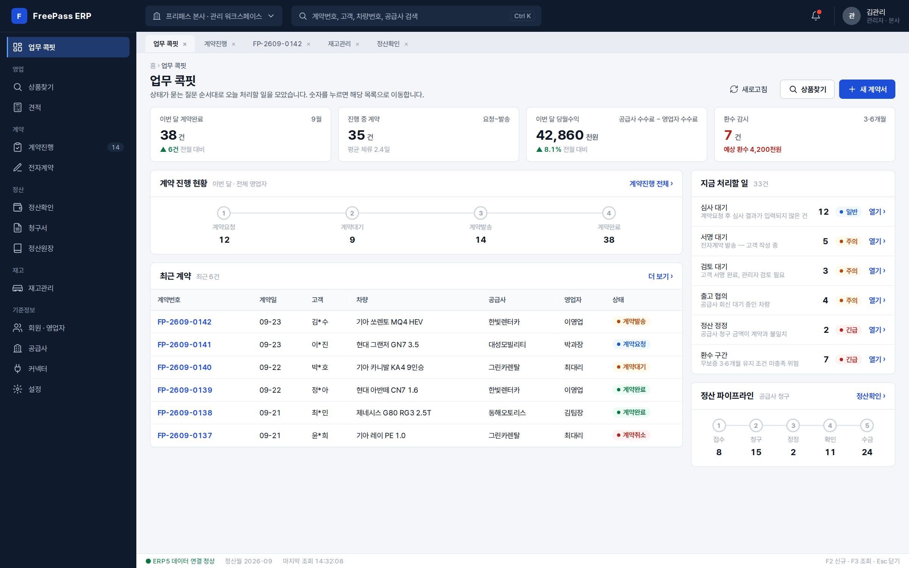

# FreePass ERP 적용 시안 — ERP 표준 UI 규격 v1 (1차, 대체됨)

> ⚠ **이 폴더는 2026-09-23 1차 적용 시안이다 — 지금 freepass-admin 이 실제로 쓰는 화면이 아니다.**
> 여기 나온 골격(업무 콕핏 홈, `app/erp5/[section]` 라우트, 계약상세 Drawer 등)은 그 뒤 §5-4
> `erp-panel` 규격(청구·정산·상품찾기·전자계약이 모두 SearchBar → QuickFilter → RowCards 목록 판 +
> 상세 판 구조)으로 다시 짜였다 — 대표 2026-09-24 「최종 확정된 규격 말고 페이지 전체 나오거나
> 했던 것들 … 없애야지」. **지금 실제로 맞는 화면은 [`../README.md`](../README.md) §5-4 와
> freepass-admin `src/app/_erp/*.tsx` 다.** 이 폴더는 초기 디자인 채택 과정의 기록으로만 남긴다 —
> 다른 AI 가 이 폴더를 보고 최신 규격으로 착각하지 않도록, 새 작업의 출발점으로 삼지 말 것.

[ERP 표준 UI 규격 v1](../README.md)을 우리 플랫폼 **프리패스 ERP(저신용·무심사 렌터카 중개)** 에 입힌 **1차** 시안이다.

| 시안 | 위치 | 상태 |
|---|---|---|
| **A · 기본** (테두리형 표준) | `platform/*.html` · `images/platform-*.png` | **채택 (테마 1 · 기본)** — 대표 결정 2026-09-23 「첫 번째 시안으로 하고, 아주 잘 만들었어」 |
| **B · 레트로** «90년대 사무용 단말기» | `platform/retro/*.html` · `images/platform-retro-*.png` · [`../themes/retro.css`](../themes/retro.css) | **채택 (테마 2)** — 대표 결정 2026-09-23 「이번 것도 느낌 좋았다. 1번 테마, 2번 테마 다 저장해서 제대로 규격화」. 같은 HTML 구조에 테마만 교체 |

시안 B 는 규격이 **테마를 갈아 끼울 수 있다**는 것도 보여 준다. HTML 은 A 와 같고 `<body data-theme="retro">` 와 `themes/retro.css` 만 더했다. 테마 값의 정본은 [`../themes/retro.json`](../themes/retro.json)(기본 토큰 중 색·모서리 43개 덮어쓰기 + `retro-*` 추가 변수 6개)이며 `npm run erp:check` 가 정본↔투영 일치와 토큰 전용 규칙을 검사한다. 레트로 표현: 크림 종이 + 모눈 바탕, 잉크 2px 테두리와 딱 떨어지는 그림자, 제목·KPI 숫자에 픽셀 글꼴(Galmuri11, OFL), 코드·금액에 고정폭(IBM Plex Mono, OFL), 도장형 뱃지, 겨자색 반전 현재 메뉴, DOS 식 상태바와 F키 키캡.

아래 설명은 두 시안에 공통이다.

- 도메인 정본: `freepass-creator/freepasserp4` @ `d8d3057` (2026-09-23 관측) — 메뉴·상태값·정산 구조를 그대로 가져왔다.
- 사람·회사 이름, 금액은 **가상 예시**다. 고객명·연락처는 마스킹 형식(`김*수`, `010-****-5678`)으로만 쓴다.
- 모든 시안은 `../erp.css` 만 쓰고 `npm run erp:check` 를 통과한다(인라인 스타일·날것 색 금지, 영역당 Primary ≤ 1).

## 시안 목록

| 시안 | 파일 | 대응하는 실제 화면 (freepasserp4) | 핵심 |
|---|---|---|---|
| 업무 콕핏 | [`home.html`](home.html) | `app/page.tsx` 홈 콕핏 | 상태가 던지는 질문(심사·서명·검토·출고협의·정산정정·환수) 순서의 «지금 처리할 일», 계약·정산 파이프라인 건수 |
| 계약진행 | [`contracts.html`](contracts.html) | `app/erp5/[section]` → `contracts` | 상태 탭(계약요청·계약대기·계약발송·계약완료·계약취소), 전자서명 단계 열, 무보증 표시, 일괄 발송 |
| 계약 상세 | [`contract-detail.html`](contract-detail.html) | 계약 상세 Drawer(미완) · `app/erp5/esign` | 계약 흐름 단계, 고객·차량·조건, 수수료(B 공급사 청구 − C 영업자 지급 = 당월수익), 전자계약 5단계, 처리 이력, 환수 감시 |
| 재고관리 | [`inventory.html`](inventory.html) | `app/inventory` · `app/erp5/[section]` → `inventory` | 출고상태(즉시출고·출고가능·출고협의·출고불가), 공급사 시트 동기화, 36개월 기준 대여료·보증금, 우대조건(무보증·만21세·분납) |
| 정산확인 | [`settlements.html`](settlements.html) | `app/erp5/[section]` → `settlements` · `app/settlement/*` | 청구 흐름(접수→청구→정정→확인→수금)·지급 흐름(접수→통보→정정→확인→지급), 건별 청구액·지급액·당월수익, 환수 감시, 월 마감 |

## 메뉴 구조 (관리 워크스페이스)

| 그룹 | 메뉴 | 실제 경로 |
|---|---|---|
| — | 업무 콕핏 | `/` |
| 영업 | 상품찾기 · 견적 | `/erp5`, `/finder` · `/estimate` |
| 계약 | 계약진행 · 전자계약 | `/erp5/contracts` · `/erp5/esign` |
| 정산 | 정산확인 · 청구서 · 정산원장 | `/erp5/settlements` · `/settlement/invoice` · `/settlement/ledger` |
| 재고 | 재고관리 | `/inventory` (관리자·공급사만) |
| 기준정보 | 회원·영업자 · 공급사 · 커넥터 · 설정 | `/members` · (신설) · `/connectors` · `/settings` |

역할별로 메뉴를 줄인다: **영업 워크스페이스**(영업자)는 상품찾기·견적·계약진행·정산확인(본인 지급분)만, **공급사**는 재고관리·계약진행(자사 차량)·정산확인(자사 청구분)만 본다. 숨기는 기준은 현재 코드의 `isProvider` 분기와 같다.

## 상태 → 뱃지 색 매핑 (정본 그대로)

| 영역 | 값 → 뱃지 | 정본 |
|---|---|---|
| 계약 | 계약요청 `info` · 계약대기/계약발송 `warn` · 계약완료 `ok` · 계약취소/철회 `err` | `lib/domain/contract.ts` 색 매핑 (blue/amber/green/red) |
| 전자계약 | 작성 · 발송 전 · 고객 작성 중 · 검토 대기 · 완료 (단계 표시) | `EsignCenterStage` |
| 출고 | 즉시출고 `ok` · 출고가능 `info` · 출고협의 `warn` · 출고불가 `err` | 상품찾기 `판매 상태` 필터 |
| 청구 / 지급 | 접수 `neutral` · 청구/통보 `info` · 정정 `err` · 확인 `warn` · 수금/지급 `ok` | `lib/domain/settlement-atom.ts` `CLAIM_STAGES` / `PAY_STAGES` |
| 정산서 | 계약완료 · 정산완료 · 진행 · 보류 · 취소 · 환수 | `lib/domain/admin-settlement.ts` `ADMIN_SETTLE_STATUS` |

## 규격에 새로 추가한 부품

시안을 그리며 ERP 규격에 없던 부품 6개를 `erp.css` 에 추가했다(모두 토큰만 사용).

| 부품 | 클래스 | 쓰임 |
|---|---|---|
| 카드 머리 | `erp-card-head` `erp-card-title` `erp-card-body` | 카드 안 제목 + «전체 보기» 링크 |
| 2단 배치 | `erp-cols` (`--half`) `erp-stack` | 본문 + 360px 보조 패널 / 반반 |
| 진행 단계 | `erp-steps` (`data-state="done"`, `aria-current="step"`) | 계약·전자서명·정산 흐름. 건수 현황일 때는 상태 없이 숫자만 |
| 처리 대기열 | `erp-queue` | «지금 처리할 일» — 질문 · 설명 · 건수 · 긴급도 · 열기 |
| 값 묶음 | `erp-props` | 상세의 라벨:값 읽기 전용 |
| 이력 | `erp-timeline` | 처리 이력(시간·주체) |
| 셀 보조줄 · 태그 | `erp-cell-sub` `erp-tag` (`--primary`) | 차명 아래 차량번호, 우대조건 |

## freepasserp4 로 옮길 때의 대응

freepasserp4 는 React(Next.js) + `components/ui` 원자 체계를 쓴다. 이 시안은 그 원자를 **대체하지 않고**, 원자가 따를 시각 규격(토큰·치수·배치)을 준다.

| 이 규격 | freepasserp4 원자 | 할 일 |
|---|---|---|
| `tokens.json` | `components/ui/tokens.ts` (`C`, `FS`, `FW`, `R`, `CTRL`) | 토큰 값을 이 규격 값으로 맞추거나 매핑표를 둔다 |
| `erp-grid` | `DataTable` (`table.tsx`) | 헤더 36 · 행 40 · 숫자 우측정렬 · 합계행 |
| `erp-badge` | `badges.tsx` | 색 + 점 + 글자 |
| `erp-kpi` | `Metric` (`metrics.tsx`) | 4열 요약 |
| `erp-section` · `erp-form-grid` | `Sec` · `FormGrid` | 4열 폼 그리드 |
| `erp-filter` | `filters.tsx` | 라벨 위 · 조회(F3) |
| 상세 | `detail-shell.tsx` · `detail-group.tsx` | 계약 상세 Drawer 에 단계·이력·환수 감시 추가 |

**주의 — 결정이 필요한 충돌**

1. freepasserp4 의 v4 철칙 1번은 «새 목록/상세는 `ObjCard`+`Sec` 카드로만»이다. 이 규격의 데스크톱 목록은 **표(그리드)** 가 기본이다. 웹은 표, 모바일은 카드(현재 `DataTable` 의 모바일=카드 동작)로 나누면 두 규칙이 함께 선다.
2. [FreePass 제품 UI 프로필](../../../docs/FREEPASS_PRODUCT_UI_PROFILE.md)은 모바일 «상단은 정보, 하단은 실행»을 잠가 두었다. 이 시안은 **웹(1280px 이상)** 전용이며 모바일 규격을 바꾸지 않는다.
3. 시안 A(테두리형) 채택으로 FreePass 웹 화면은 이 규격을 따른다. `design/claude-v1`(무테두리) 규격을 보관할지 정리할지는 남은 결정이다.
