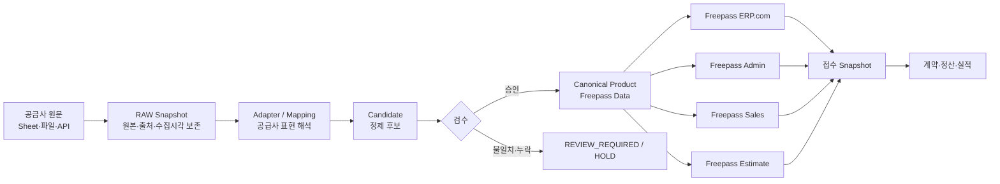

# Freepass 제품군 정의

기준일: 2026-09-20  
상태: 사용자 결정 반영 / 물리 폴더 정렬 전

## 1. Freepass 전체 정의

**Freepass**는 하나의 사업 프로젝트이고, 아래 다섯 제품·서비스로 나눈다.

**대표 얼굴과 기본 진입 서비스는 `Freepass ERP.com`이다.** 화이트라벨 판매 화면이 고객·영업자·제휴 채널이 Freepass를 처음 만나는 메인 제품이고, Admin·Sales·Estimate·Data는 이 메인 서비스를 운영하고 확장하는 전문 제품이다.

```text
Freepass
├─ Freepass ERP.com     영업자용 화이트라벨 판매 플랫폼
├─ Freepass Admin       내부 운영·관리
├─ Freepass Sales       영업 CRM
├─ Freepass Estimate    신차·중고차 견적 정본
└─ Freepass Data        상품·정책·접수·정산 데이터 서비스
```

`Freepass ERP 4`는 별도 구세대 제품이 아니라 `Freepass ERP.com`으로 진화한 코드 계보다.
`Firebase ERP5`라는 과도기 명칭은 서비스 이름으로 사용하지 않고 `Freepass Data`로 부른다.

## 2. 프로젝트명·폴더명·저장소명·서비스명

| 내부 프로젝트명 | 목표 로컬 폴더 | 현재 GitHub 저장소 | 사용자에게 보이는 서비스명 | 역할 |
|---|---|---|---|---|
| Freepass ERP.com | `C:\dev\freepasserp.com` | `freepass-creator/freepasserp4` | **Freepass ERP.com** | 영업자가 차량을 찾고 고객에게 카탈로그를 보여주는 화이트라벨 판매 플랫폼 |
| Freepass Admin | `C:\dev\freepass-admin` | `freepass-creator/freepass-admin` | **Freepass Admin** | 상품·접수·계약·정산과 Data Monitor를 사용하는 내부 관리자 화면 |
| Freepass Sales | `C:\dev\freepass-sales` | `freepass-creator/freepass-sales` | **Freepass Sales** | 고객·통화·후속조치·영업단계 관리 |
| Freepass Estimate | `C:\dev\freepass-estimate` | `freepass-creator/freepass-estimate` | **Freepass Estimate** | 신차·중고차 견적 UI·계약·계산 provider의 정본 |
| Freepass Data | 별도 앱 폴더를 당장 만들지 않음 | Firebase/Firestore `freepasserp5` | **Freepass Data** | 원문·매핑·후보·검수·Canonical Product·접수/정산 데이터 서비스 |

### 현재 로컬과 목표 이름의 차이

| 현재 로컬 | 실제 원격 | 목표 |
|---|---|---|
| `C:\dev\freepasserp4` | `freepasserp4` | 안전한 정렬 후 `C:\dev\freepasserp.com` |
| `C:\dev\freepasserp.com` | `freepass-admin` | 안전한 정렬 후 `C:\dev\freepass-admin` |
| `C:\dev\sales`·`C:\dev\freepass-sales` | 둘 다 `freepass-sales` | 주 체크아웃을 `C:\dev\freepass-sales` 하나로 확정하고 나머지는 작업트리/보관 판정 |
| 최상위 체크아웃 미확인 | `freepass-estimate` | `C:\dev\freepass-estimate`로 정식 체크아웃 |

이 표는 목표 이름이다. 현재 폴더에는 미커밋 작업과 분기된 커밋이 있으므로 즉시 이동·덮어쓰기하지 않는다. 각 폴더의 미커밋·미푸시·stash·worktree 참조를 확인한 뒤 별도 정리 작업으로 실행한다.

## 3. 제품별 책임

### Freepass ERP.com

- Freepass ERP 4의 최종 진화 제품이다.
- Freepass 제품군의 메인 얼굴이자 기본 진입점이다.
- 영업자와 제휴 채널이 차량·상품을 검색한다.
- 고객에게 보여줄 카탈로그와 상품 상세를 제공한다.
- 화이트라벨별 브랜드·노출 정책을 적용한다.
- 새 판매·채널 기능은 먼저 ERP.com에서 어떤 얼굴로 제공되는지 판단하고, 내부 운영 기능만 Admin·Sales·Estimate로 보낸다.
- 상품 원문과 정제 규칙을 직접 편집하는 데이터 관리 화면은 두지 않는다.

### Freepass Admin

- 내부 관리자가 상품·접수·계약·정산을 처리한다.
- Canonical Product 검수와 예외 처리를 담당한다.
- `Freepass Data Monitor`의 사용자 화면을 제공한다.
- ERP.com·Sales·Estimate가 소비한 데이터 상태를 한눈에 확인한다.

### Freepass Sales

- 고객과 통화 이력, 다음 행동, 영업 진행 상태를 관리한다.
- 견적 계산 원본을 자체적으로 만들지 않고 Freepass Estimate를 소비한다.
- 상품 정본을 자체적으로 만들지 않고 Freepass Data를 소비한다.

### Freepass Estimate

- 신차·중고차 견적 기능의 upstream 정본이다.
- `/new`, `/new/cost`, `/used`, `/used/cost`, `/quotes`를 소유한다.
- Sales, 파트너 채널, 다른 소비 화면으로 검증된 견적 기능을 내려보낸다.
- 과거 `welrixtable`, `sonogong-estimator`, `freepasserp4` 견적 구현은 참고·회귀 자료다.

### Freepass Data

- Firebase/Firestore 프로젝트 ID는 `freepasserp5`를 유지한다.
- 표시 이름과 내부 업무명은 `Freepass Data`를 사용한다.
- 데이터 저장·정제·검수·배포 상태를 소유한다.
- 사용자 화면을 별도 공개 서비스로 만들지 않고 Freepass Admin에서 모니터링한다.
- 인증은 현재 확인된 운영 경계를 유지한다. `freepasserp3` Auth와 `freepasserp5` 데이터가 혼재한 상태는 모니터와 이관 감사 대상으로 둔다.
- RTDB는 사용하지 않는다.

## 4. Freepass Data 흐름



핵심 원칙:

1. 공급사 RAW를 덮어쓰지 않는다.
2. 같은 공급사 표현의 승인된 매핑은 재사용한다.
3. 새 표현·모순·양식 변경은 자동 확정하지 않고 검수로 보낸다.
4. Canonical Product가 판매 화면들의 공통 상품 정본이다.
5. 검색 인덱스와 화면 캐시는 Canonical에서 다시 만들 수 있는 읽기 모델이다.
6. 접수 당시 상품 조건은 Snapshot으로 고정한다.

## 5. Freepass Data Monitor

위치: **Freepass Admin 내부 메뉴 `Data Monitor`**  
권한: 내부 관리자 읽기 중심. 데이터 수정은 별도 검수·승인 흐름으로 분리한다.

### 한 화면에서 보여줄 것

| 영역 | 표시 내용 |
|---|---|
| 원천 | 공급사, 원천 종류, 마지막 수집시각, snapshot ID, 원문 건수, source digest |
| 정제 | adapter 이름·버전, 입력/출력 건수, 매핑 성공·누락·충돌, 변환 실행 ID |
| 검수 | Candidate·승인·반려·`REVIEW_REQUIRED`·`HOLD` 건수와 사유 |
| Canonical | 현재 상품 버전, 차량 매칭 깊이, Offer/Policy 수, 중복·비활성 상태 |
| 배포 | ERP.com·Admin·Sales·Estimate별 마지막 동기시각, 소비 revision, 전달 건수 |
| 접수·정산 | 접수 snapshot, 계약 연결, `settlement_rows`·atom 처리 상태 |
| 불일치 | 원천↔Canonical↔소비처 건수/키/버전 차이와 마지막 정상 시점 |
| 감사 | 실행자, 코드 commit, Firebase project ID, 시작/종료시각, 결과와 재시도 링크 |

### 기존 자산에서 재사용할 것

- `freepass-admin/scripts/erp5-snapshot.mts`: `freepasserp5` 상품 읽기·스냅샷
- `freepass-admin/scripts/erp5-ledger.mts`: `settlement_rows` 읽기·원장 스냅샷
- `freepass-admin/scripts/erp5-atomize.mts`: 원본을 보존한 atom 후보 생성
- `freepass-admin/src/adapters/erp5/*`: ERP5 → Canonical 변환
- `freepasserp4/app/data-check`: 데이터 대조 화면
- `freepasserp4/app/audit`: 감사 화면
- `freepasserp4/app/diag`: 연결 진단
- `freepasserp4/app/api/sheet/sync-status`: 동기화 상태
- `freepasserp4/app/api/sheet/live-status`: 원천 연결 상태
- `freepasserp4/app/api/inventory/reconcile-state`: 재고 정합성 상태

기존 화면을 그대로 합치지 않는다. 먼저 위 기능의 입력·출력 계약을 추출하고, Freepass Admin의 Data Monitor가 읽기 전용으로 소비하도록 한다.

## 6. 이름 사용 규칙

| 잘못 섞기 쉬운 이름 | 앞으로의 의미 |
|---|---|
| Freepass ERP 4 | 코드 계보와 GitHub 저장소를 설명할 때만 사용 |
| Freepass ERP.com | 현재 화이트라벨 판매 서비스 |
| ERP5 / Firebase ERP5 | 기술 이력 또는 Firebase project ID 설명에만 사용 |
| Freepass Data | `freepasserp5` 데이터 서비스의 공식 내부 명칭 |
| 견적기 / Estimate | 공식 제품명은 `Freepass Estimate` |

## 7. 완료 순서

1. 이 이름표를 AI Core와 각 Freepass 저장소의 프로젝트 설명에 반영한다.
2. 로컬 폴더별 미커밋·미푸시·stash·worktree를 감사한다.
3. `freepass-admin`, `freepass-sales`, `freepass-estimate`를 GitHub 이름과 같은 로컬 폴더로 정렬한다.
4. `freepasserp4` 체크아웃을 `C:\dev\freepasserp.com` 제품 폴더로 정렬한다.
5. Data Monitor가 재사용할 기존 진단·동기화 계약을 목록화한다.
6. 개인정보 없는 fixture로 `원천 → 정제 → Canonical → 소비처` 한 경로를 연결한다.
7. 실제 데이터는 읽기 전용 대조 후 사용자 승인 범위에서만 연결한다.

## NEXT_START_HERE

`freepass-admin`과 `freepasserp4`에서 데이터 모니터에 재사용할 route/script의 입력·출력·writer 여부를 표로 만들고, 읽기 전용으로 바로 연결 가능한 항목과 수정이 필요한 항목을 구분한다.
