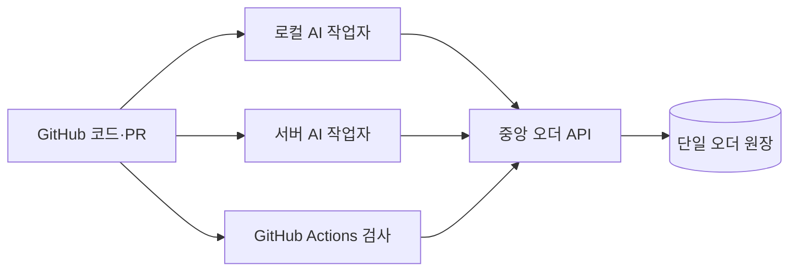

# 로컬·서버 공통 오더 실행

## 구조

통합 조정: 최종 공통 작업 원장은 PR #20의 work ledger를 사용한다. 아래 중앙 오더 API/SQLite는 PR #21 접수·claim UI 시제품이다. [통합 경계](ORDER_CONTROL_INTEGRATION.md)의 order_id → work_id 어댑터가 필요하며 아직 연결되지 않았다. 사용자는 말로 지시하고 아래 기술 명령은 담당 AI가 수행한다.

GitHub는 코드·리뷰·커밋의 기준이다. 업무 상태는 하나의 중앙 원장에 저장한다. 프로젝트 저장소는 계속 분리한다.



중앙 API는 loopback에만 바인딩한다. 다른 장치에서는 SSH 터널을 사용한다. `orders.connection.json`의 원장 ID는 잘못된 원장 연결을 검출하는 식별자이며 인증 키가 아니다. SSH 계정과 키가 접근 경계다. 연결된 사용자는 원장 전체에 접근할 수 있다. 여러 사용자의 역할별 권한은 아직 제공하지 않는다.

현재 중앙 원장은 이 PC의 `C:\dev\ai-core\.local\orders.sqlite`다. 실제 원격 서버는 아직 지정·연결하지 않았다. 같은 PC에서 분리한 클라이언트와 테스트 서버의 통신을 검증한 단계다.

## 공통 명령

Node.js 24.19.0과 검토된 같은 GitHub 커밋을 사용하고 각 작업 폴더에서 `npm ci`를 실행한다. `.local`과 DB는 Git에 올리지 않는다.

현재 중앙 서비스를 이 PC에서 시작:

```powershell
node src/orders/server.mjs --db C:\dev\ai-core\.local\orders.sqlite
node scripts/orders.mjs connect http://127.0.0.1:4318
node scripts/orders.mjs meta
node scripts/orders.mjs list
node scripts/orders.mjs packet ORD-실제번호 T1
```

서버가 중앙 원장을 맡게 되면 서버에서 절대 DB 경로를 지정한다. 원본 DB를 이관하기 전 빈 DB로 시작하면 원장 ID 불일치로 거부된다.

```sh
node src/orders/server.mjs --db /srv/ai-core-data/orders.sqlite
```

원격 작업 장치는 검증된 SSH 호스트 키와 승인된 계정을 사용한다. 아래 HOST와 USER는 실제 값으로 지정해야 한다. 현재 구현의 Host 검사 때문에 터널 양쪽 포트는 4318로 맞춘다. 로컬 4318 서비스를 먼저 종료하여 포트 충돌을 해소한다.

```sh
ssh -N -o BatchMode=yes -o ExitOnForwardFailure=yes -o StrictHostKeyChecking=yes -L 127.0.0.1:4318:127.0.0.1:4318 USER@HOST
```

다른 터미널에서 위와 같은 `connect`, `meta`, `list`, `packet`, `act` 명령을 쓴다. 환경변수 `AI_CORE_ORDERS_URL=http://127.0.0.1:4318`로도 연결할 수 있다. URL 환경변수가 장치별 저장 설정보다 우선한다. 코드의 원장 ID 고정은 그대로 적용한다.

서버 중단·잘못된 원장·응답 오류는 실패로 반환한다. 별도 로컬 DB로 자동 대체하지 않는다. 응답이 유실된 쓰기는 같은 requestId와 같은 JSON을 재전송한다. 버전 충돌이면 현재 원장을 읽고 요청 의도를 다시 확인한다.

독립 실험은 `node scripts/orders.mjs --local --db 임시경로 list` 또는 `node src/orders/server.mjs --standalone --db 임시경로 --port 4319`처럼 명시한다. 이것은 공유 업무 원장이 아니다.

브라우저도 원장 ID를 저장하고 변경 시 중단한다. 계획된 정본 교체 후에는 이전 초안과 요청을 보존·대조한 다음 해당 브라우저 origin의 `order-ledger-id`만 명시적으로 재설정한다. 모든 localStorage를 일괄 지우지 않는다.

## 중앙 서버 이관 순서

1. 대상 서버·저장 위치·SSH 접근 범위와 검토된 GitHub 커밋을 확정한다.
2. 모든 쓰기를 중단하고 기존 서비스를 정상 종료한다. DB와 WAL 등 필요한 파일을 일관된 상태로 백업하며 원본을 보존한다.
3. 백업을 승인된 서버로 복사한다. 원장 ID, 오더 ID·버전, 이벤트와 중복 요청 영수증을 원본과 대조한다. CLI `export`는 열람용이며 완전한 DB 백업이 아니다.
4. 새 서비스를 하나만 시작하고 로컬·서버 클라이언트의 읽기, 경쟁 확보, 응답 유실 재시도를 확인한다.
5. 모든 클라이언트를 새 서비스로 연결한다. 이전 DB는 쓰기 불가 상태로 보존한다. 되돌릴 때도 새 서비스를 먼저 멈추고 변경분을 확인한다.

복사한 DB는 같은 원장 ID를 가진다. ID 검사는 두 사본의 동시 쓰기를 막는 합의 시스템이 아니다. **동시에 쓰기를 받는 중앙 서비스는 반드시 하나**여야 한다. 자동 장애 전환·복제·오프라인 병합은 현재 범위에 없다.

## GitHub에서 검사

`shared-order-check.yml`은 수동 검사 초안이다. 기본 브랜치의 검토된 코드만 실행하며 오더 번호·작업 번호를 입력한다. 저장소 테스트 후 중앙 원장에서 최소 작업 문맥만 읽는다. `record_result=true`를 선택한 실행만 검사한 커밋과 Actions 링크를 오더의 참고 메모로 기록한다. 테스트 성공은 작업 완료나 요구사항 전체 검증을 의미하지 않는다.

실행 준비에는 기본 브랜치 반영, `ai-core-private-runner` 환경과 필요한 승인 규칙, `AI_CORE_SSH_HOST/USER` 변수, `AI_CORE_SSH_PRIVATE_KEY/KNOWN_HOSTS` 비밀 설정이 필요하다. 아직 설정·배포하지 않았다. 키는 해당 서버의 필요한 포워딩만 허용하도록 제한한다. 실제 키와 호스트 키를 저장소에 커밋하지 않는다.

실행 산출물은 최소 검사 영수증과 재전송 명령이다. 원장 본문이나 인증 키를 산출물에 포함하지 않는다. 메모 응답 유실 시 산출물의 동일 명령을 검토 후 `act`로 재전송한다. 요구 버전 충돌은 자동으로 덮어쓰지 않는다.

GitHub의 수동 실행은 워크플로가 기본 브랜치에 있어야 한다. [공식 수동 실행 안내](https://docs.github.com/actions/managing-workflow-runs/manually-running-a-workflow). SSH 포워딩 시작 성공만으로 원장 응답을 보장하지 않아 별도로 `meta`를 검사한다. [OpenSSH 설정 설명](https://man.openbsd.com/ssh_config.5).

## 사용자 오더 예시

- “이 오더를 서버에서 이어서 구현해줘. 완료 조건은 그대로야.”
- “서버에서 한 결과를 로컬에서 확인하고 같은 오더에 검증을 남겨줘.”
- “이 GitHub 커밋 기준으로 검사하고 결과 링크를 해당 오더에 남겨줘.”

현재 AI 실행은 수동 인계다. 실행 장소·오더 번호·커밋을 공통 인계에 포함하며, 어떤 장치에서 했든 결과는 동일한 오더에 기록한다. 실제 서버 실행은 대상 서버 연결 후 가능하다.
