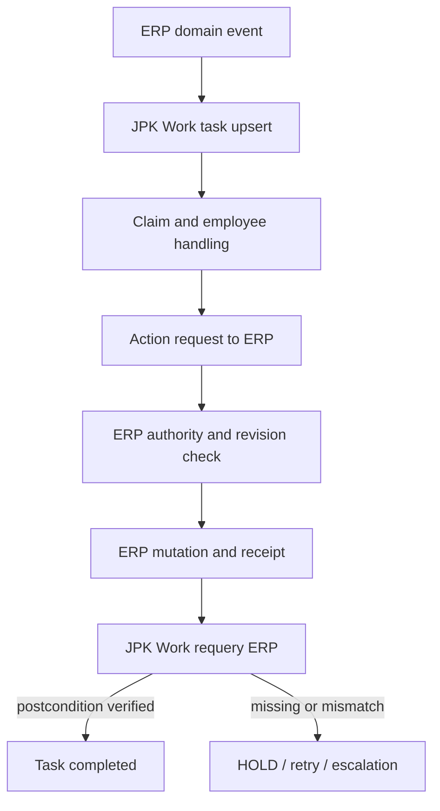

# 렌터카 ERP ↔ JPK Work 최소 연동 계약

- 기준일: 2026-09-20
- 관련 이슈: #178
- 성격: 읽기 전용 조사에 근거한 설계 handoff
- 실행 권한: 없음
- 실제 데이터 조회·수정·배포: 하지 않음

## 1. 결정

렌터카 ERP와 JPK Work는 **분리된 시스템**으로 유지한다.

- 렌터카 ERP가 차량·계약·출고/반납·청구/수납/미수·정비/보험·과태료의 도메인 정본과 변경 권한을 가진다.
- JPK Work는 할 일의 배정·기한·claim·진행·검토·후속·누락과 업무 이력만 가진다.
- JPK Work에는 ERP 원문·고객정보·금액 원장을 복제하지 않는다. 안정적인 reference, 비식별 summary, 최소 업무 상태만 둔다.
- JPK Work의 사람이 누른 “완료”는 최종 완료가 아니다. ERP의 성공 receipt와 ERP 재조회 postcondition이 모두 확인돼야 `COMPLETED`가 된다.
- receipt 누락, 부분 반영, revision 충돌, 권한 부족, 재조회 불일치는 모두 fail-closed로 `HOLD` 또는 `FAILED`다.

## 2. 확인된 canonical 경계

| 시스템 | canonical repo | 기준 revision | 판정 | 근거 |
|---|---|---:|---|---|
| 렌터카 ERP | `freepass-creator/renman` | `262e06de09db94a116fa377ea2f5dbe024bb086b` | CONFIRMED | README가 jpkerp6 렌터카 ERP를 선언하고 차량·계약·미수·과태료·보험·업무 도메인 코드와 API가 함께 존재한다. `.firebaserc`의 확인된 Firebase project는 `renman-dd0a2`다. |
| JPK Work | `freepass-creator/teamjpkwork` | `75bb285a241b68c13acbe532c30d6d91110f8082` | CONFIRMED | README가 직원의 오늘 할 일 본체와 공식 저장소명 `teamjpkwork`를 선언하고 `work_todo`, 업무 API, 담당·기한·완료 이력을 구현한다. README가 명시한 Firebase project는 `teamjpkwork`다. |
| 기존 운영 보조/브리지 | `freepass-creator/aiops` | `03dd804962eb4e345b7a34b3e0e97e8bc6d5efe3` | REFERENCE | 과태료 업무카드 투영과 TeamJPKwork 브리지, 과태료 입력 guard가 있다. 새 정본이 아니라 재사용 후보다. |
| AI Core 계약 | `freepass-creator/ai-core` | `9b520f3e1f79b54813159b4deb0f020d8ca64bde` | CANONICAL CONTRACT | `core-event/v1`, `core-receipt/v1`, workflow bridge, work ledger event 계약을 재사용한다. |

주의:

- `workcontrol`은 2026-09-20 최신 커밋에서 AIOps 이관 후 retire 대상으로 표시돼 canonical이 아니다.
- `jpkerp2`, `jpkerp5`도 최신 커밋에서 non-authoritative/retirement blocker가 기록돼 이번 연동의 정본으로 쓰지 않는다.
- JPK Work 저장소 안의 `lib/penalty/**`, 계약/수납/차량 store는 기존 혼합 구조의 migration debt다. 이 코드의 존재를 JPK Work가 도메인 정본이라는 근거로 해석하지 않는다.
- 확인된 project ID 외의 Firebase 이름은 추정하지 않는다.

## 3. 현재 코드에서 확인된 재사용 자산과 결함

### 렌터카 ERP

재사용:

- `lib/domain/atomic-event.ts`: event id, idempotency key, entity links의 기존 원형.
- `lib/penalty-intake.ts`, `lib/penalty-match.ts`, `lib/penalty-reassign.ts`, `lib/penalty-work.ts`: 과태료 intake·매칭·상태·업무 투영.
- `lib/work-ledger.ts`: 업무 상태·기한·담당자 표시를 위한 projection.
- 도메인 API는 `app/api/entities/[entity]/route.ts` 등으로 이미 존재한다.

보완:

- 현재 atomic event의 idempotency key는 entity/date 중심이라 “업무를 유발한 특정 도메인 사건”의 revision과 action intent를 충분히 구분하지 못한다.
- ERP 내부 `work_item`은 남겨도 되지만, JPK Work task와 동일 정본으로 취급하면 안 된다. ERP 내부 항목은 도메인 작업/투영, JPK Work는 사람 업무 조정 기록으로 역할을 명시해야 한다.

### JPK Work

재사용:

- `work_todo` 컬렉션과 안정적 업무 key, 담당·기한·사람/증거 종료 이력.
- `app/api/work/todo/route.ts`: 업무 생성/조회 진입점.
- `lib/erp/사건큐.ts`: 비동기 queue와 중복 방지의 초기 형태.

반드시 교체/차단:

- `lib/erp/할일만들기.ts#할일닫기`는 사람이 직접 `닫힘`을 쓸 수 있다. ERP 반영 receipt가 없는 최종 종료이므로 새 연동 업무에는 사용 금지다.
- `lib/erp/write.ts#한건처리`는 먼저 완료를 기록하고 원장/자산 반영 실패 시에도 완료를 되돌리지 않는다. 이슈 #178의 fail-closed 요구와 정면 충돌한다.
- `lib/erp/actions.ts#처리하기` 반환 타입에는 `원장반영`이 있지만 실제 반환은 `자산반영`만 포함한다. 실패 가시성이 소실된다.
- `lib/erp/사건큐.ts`의 key가 사건+차량+날짜+actor라 서로 다른 ERP revision/action을 합칠 수 있다.
- `lib/erp/fbtasks.ts`는 ERP 도메인 원자를 직접 읽어 업무를 계산한다. 새 구조에서는 ERP가 내보낸 event/task projection만 받아야 한다.

### AIOps 기존 connector

- `project-employee-task-cards-v1.mjs`는 과태료 원자에서 비식별 업무카드를 만들고 idempotency 및 재조회 검증을 한다.
- `bridge-task-cards-to-teamjpkwork-v1.mjs`는 기존 업무를 보존하면서 missing task만 삽입하고 재조회한다.
- 그러나 claim, action request, ERP execution receipt, ERP postcondition requery, 취소/갱신 전파가 없다. **SHADOW/PILOT 재사용**만 가능하고 canonical write connector로 승격하려면 아래 계약을 구현해야 한다.

## 4. 최소 연동 흐름



직접 상태 전이는 금지한다. JPK Work는 action request만 보낼 수 있고, ERP만 도메인 변경을 실행한다.

## 5. 최소 계약

### 5.1 ERP → JPK Work: WorkEvent

필수 필드:

| 필드 | 규칙 |
|---|---|
| `event_id` | ERP가 발급한 immutable event ID |
| `idempotency_key` | `erp:{event_type}:{entity_type}:{entity_id}:{source_revision}`를 기본으로 하되 동일 의미 사건 재전송은 같은 값 |
| `entity_type`, `entity_id` | opaque reference. 고객명·전화·주민번호 금지 |
| `source_revision` | ERP entity/event의 단조 증가 revision 또는 Firestore updateTime |
| `task_type` | versioned code. 예: `PENALTY_EVIDENCE_REPAIR.v1` |
| `summary` | 비식별 한 줄. 상세 도메인 값은 ERP deep link/권한 조회 |
| `due_at` | RFC 3339 datetime 또는 null |
| `assignee` | 제안 담당자. 최종 배정은 JPK Work |
| `authority_required` | ERP 쓰기에 별도 승인/권한이 필요한지 |
| `evidence_refs` | 원문이 아닌 ERP 내부 ref/digest |
| `correlation_id`, `causation_id` | AI Core event chain 추적 |
| `occurred_at`, `recorded_at` | 사건·기록 시각 |

`core-event/v1` envelope을 사용하고 사용자 후보 필드를 payload/task projection에 둔다. payload에 ERP 원문 전체를 넣지 않는다.

### 5.2 JPK Work task

```json
{
  "task_id": "jpk_work_task_...",
  "event_id": "erp_evt_...",
  "idempotency_key": "erp:penalty.notice_ready:penalty:opaque-id:r42",
  "entity_type": "penalty",
  "entity_id": "opaque-id",
  "source_revision": "r42",
  "task_type": "PENALTY_REBILL_REQUEST.v1",
  "summary": "변경부과 요청 접수 근거 등록",
  "due_at": "2026-09-23T09:00:00+09:00",
  "assignee": null,
  "authority_required": true,
  "status": "OPEN",
  "action_request": null,
  "execution_receipt": null,
  "evidence_refs": ["erp://penalty/opaque-id/evidence/notice"]
}
```

허용 상태:

`OPEN → CLAIMED → IN_PROGRESS → AWAITING_AUTHORITY → ACTION_REQUESTED → APPLYING → VERIFYING → COMPLETED`

예외 상태:

- `HOLD`: 권한, revision, evidence, 외부기관, receipt 또는 requery 문제. 재개 가능.
- `FAILED`: non-retryable 실패. 새 action request 또는 관리자 결정 필요.
- `CANCELLED`: ERP의 원인 사건 취소/정정 receipt 필요.
- `SUPERSEDED`: 새 source revision이 기존 업무를 대체. 옛 task는 감사용 보존.

`COMPLETED` 진입 guard:

1. `execution_receipt.status === SUCCEEDED`
2. receipt의 `operation_id/request_id`가 현재 action request와 일치
3. receipt의 `source_revision`이 요청의 expected revision 이상
4. ERP 재조회가 task type별 postcondition을 만족
5. receipt와 재조회 evidence ref가 감사로그에 남음

하나라도 실패하면 `COMPLETED` 금지.

### 5.3 Claim

- `claim_id`, `task_id`, `claimed_by`, `claimed_at`, `lease_until`, `task_revision`.
- 원자적 compare-and-set으로 한 명만 claim.
- lease 만료 전 heartbeat 또는 release.
- 완료/실행 권한과 claim 권한을 분리한다.

### 5.4 JPK Work → ERP: ActionRequest

필수:

- `request_id`, `idempotency_key`
- `task_id`, `event_id`
- `entity_type`, `entity_id`
- `expected_source_revision`
- `action_type`
- allowlist된 최소 `parameters`
- `requested_by`, `authority_ref`
- `evidence_refs`, `correlation_id`

ERP는 expected revision 불일치 시 쓰지 않고 `HOLD/REVISION_CONFLICT` receipt를 반환한다. JPK Work가 ERP 데이터를 직접 쓰는 credential을 가지면 안 된다.

### 5.5 ERP → JPK Work: ExecutionReceipt

AI Core `core-receipt/v1`을 그대로 사용한다.

추가 output refs에 다음을 담는다.

- 변경된 ERP entity ref
- before/after source revision
- postcondition query ref
- domain audit event ref

`SUCCEEDED` receipt도 곧바로 완료를 뜻하지 않는다. JPK Work connector가 ERP를 재조회하고 postcondition을 검증해야 한다. `PARTIAL`, `HOLD`, `FAILED`, timeout, malformed receipt는 모두 fail-closed다.

## 6. 첫 파일럿 추천: 과태료

| 후보 | 기존 코드 재사용 | 쓰기 위험 | receipt/postcondition 명확성 | 판단 |
|---|---:|---:|---:|---|
| 과태료 | 매우 높음 | 중간 | 높음 | **1순위** |
| 미수 | 높음 | 매우 높음(금전·수납) | 입금 재조회까지 필요 | 2차 |
| 계약만료/반납 | 중상 | 높음(차량·계약 다중 전이) | 다중 postcondition | 3차 |
| 정비/보험 | 중간 | 중상 | 보험은 현재 read-only adapter 중심 | 4차 |

근거:

- ERP에 intake/match/reassign/work projection이 있다.
- AIOps에 pure guard, 업무카드 projector, TeamJPKwork bridge, 발송 가능 검증, idempotency/requery가 이미 있다.
- JPK Work에도 과태료 UI/업무 코드가 있어 사용자 동선 검증 자산이 가장 많다.
- 기존 `FINE_EVIDENCE_REPAIR`, `FINE_REBILL_REQUEST`, `FINE_SUPPLIER_RESPONSE` task code를 versioned code로 승격할 수 있다.

파일럿 범위는 **한 단계만** 잡는다:

`PENALTY_EVIDENCE_REPAIR.v1`

- 이벤트: ERP가 계약/반납 근거 부족을 확인.
- 직원 처리: 필요한 근거를 확보하고 JPK Work에 evidence ref만 첨부.
- action request: ERP에 근거 연결/재판정 요청.
- ERP postcondition: 해당 penalty가 명확한 계약/차량에 연결되고 hold reason이 제거됐거나, 새로운 명시적 hold reason으로 바뀜.
- JPK Work 완료: SUCCEEDED receipt + ERP 재조회 postcondition 확인 후만.

기관 발송/금액 변경은 2번째 단계로 미룬다. 첫 파일럿에서 connector·receipt·requery를 검증한 후 `PENALTY_REBILL_REQUEST.v1`로 확대한다.

## 7. Work packet

상세 기계판독 packet: `docs/coordination/ISSUE-178-RENTAL-ERP-JPK-WORK-PACKET.v1.json`

| packet | repo | 산출물 | 선행조건 | 완료 기준 |
|---|---|---|---|---|
| 178-A | ai-core | event/task/action/receipt JSON schema와 synthetic fixture | 계약 리뷰 | schema validation + negative fixture 통과 |
| 178-B | renman | penalty event outbox, read projection, allowlisted action endpoint, receipt, requery | 178-A | 중복요청 1회 처리, revision conflict 무쓰기, audit ref |
| 178-C | teamjpkwork | task inbox/upsert, claim lease, action request, receipt 소비, verify guard | 178-A | receipt 없이 완료 불가, ERP 원문 저장 금지 |
| 178-D | aiops | 기존 projector/bridge를 SHADOW adapter로 감싸고 비교 보고 | 178-A~C | 생성/갱신/종결 parity, canonical write 없음 |
| 178-E | cross-repo | synthetic E2E 및 장애주입 | 178-B~D | timeout/partial/malformed/revision conflict 모두 HOLD |
| 178-F | migration | JPK Work 내 도메인 복제 코드의 read-only/retire 계획 | pilot 안정화 후 | ERP SSOT 침범 경로 0 |

모든 packet은 현재 revision에 pin하고, 구현 직전 재조회한다. 사용자 별도 승인 전 `execution_authorized=false`다.

## 8. 검증 시나리오

1. 같은 event/idempotency key 3회 수신 → JPK Work task 1건.
2. 더 높은 source revision 수신 → 기존 task 갱신 또는 SUPERSEDED, 중복 생성 없음.
3. 두 직원 동시 claim → 1명만 성공.
4. 권한 없는 action request → ERP 무쓰기 + HOLD receipt.
5. expected revision 불일치 → ERP 무쓰기 + `REVISION_CONFLICT`.
6. ERP mutation 성공, receipt 유실 → JPK Work HOLD; retry는 같은 idempotency key로 같은 결과 회수.
7. receipt SUCCEEDED, requery 불일치 → VERIFYING/HOLD, 완료 금지.
8. receipt PARTIAL/FAILED/malformed → 완료 금지.
9. ERP에서 외부 처리로 postcondition이 이미 성립 → verified event/requery로 증거 종료.
10. task 저장소에 고객명·전화·주민번호·ERP 원문 payload가 없음.

## 9. 근거 revision과 파일

### teamjpkwork @ `75bb285a241b68c13acbe532c30d6d91110f8082`

- `README.md` blob `610f03d77916c9624f04e07e9d5cba54abb5b26f`
- `lib/erp/할일만들기.ts` blob `56c0988334f84d4d8c474711fa1e3f1aaa4d524e`
- `lib/erp/사건큐.ts` blob `e3643a76580eec9d33c2eef4a803a071e189ce37`
- `lib/erp/write.ts` blob `721dbe2ab9fce232579611319d59d8b78a1ecf64`
- `app/api/work/todo/route.ts` blob `ec166c5eae1f39e75e9d2c4782dee61355f2dd83`
- `lib/erp/fbtasks.ts` blob `117fc5f4956ac660c47032fc5101162c144bf012`

### renman @ `262e06de09db94a116fa377ea2f5dbe024bb086b`

- `README.md` blob `d6b45a91bbb80d1652cca9fe1b5f3b46b7f2b34d`
- `.firebaserc` blob `d59c64069cd0540de5340d4b472ebc30d794b8db`
- `lib/domain/atomic-event.ts` blob `fe16c7cca6a39253fb759ff44d210a9e7fa69d4c`
- `lib/penalty-work.ts` blob `4b6442e7f551272836e771320c700ba6e12275d7`
- `lib/penalty-intake.ts` blob `77692f3e47ba80f3019fba475bf6123833d918d8`
- `lib/penalty-match.ts` blob `8b7187f8f5aa9b15acb4352c4da08a3f2d971221`
- `lib/penalty-reassign.ts` blob `fba684448695c34b88cf44a09c48f18183d0287d`
- `lib/work-ledger.ts` blob `f09f43da4ea40fb50394f6329d21ada78ddb5a2d`

### aiops @ `03dd804962eb4e345b7a34b3e0e97e8bc6d5efe3`

- `wonja/project-employee-task-cards-v1.mjs` blob `f7c86be04e7a1b333b4cc6e4534fe021de738b7b`
- `wonja/bridge-task-cards-to-teamjpkwork-v1.mjs` blob `5426c20bae7623559481a785078d969df574c6b0`
- `lib/penalty-intake-guard.mjs` blob `a6e24dac12599838ef6a92f4e5944387b83b1956`
- `docs/AI_CORE_INSURANCE_ADAPTER.md` blob `2b84317dc4daa7dca6837d9aabb83f1247879c93`

### ai-core @ `9b520f3e1f79b54813159b4deb0f020d8ca64bde`

- `contracts/core-event.schema.json` blob `cba3bdaebc839e91b9993934f0922575b570f181`
- `contracts/core-receipt.schema.json` blob `a2e8583200ef542ce3cb01ec90ef51428fa77ae3`
- `contracts/workflow-bridge.schema.json` blob `6464f314f9461b9bc72ca864fc10b1dba94f75b4`
- `contracts/work-ledger-event.schema.json` blob `ce9cb2e8c0201661b4b05e8c7a31445f19c8e442`

## 10. Next start here

1. 이 설계와 packet을 리뷰해 `PENALTY_EVIDENCE_REPAIR.v1`을 첫 파일럿으로 확정한다.
2. 178-A에서 synthetic fixture와 negative case를 먼저 만든다.
3. 구현 직전 세 저장소 revision을 재조회하고 변경됐으면 packet을 HOLD로 돌린다.
4. 178-B/C를 feature flag + SHADOW mode로 연결한다.
5. receipt/requery 장애주입 테스트가 모두 통과한 뒤에만 제한된 PILOT write를 별도 승인한다.
6. pilot이 안정화되기 전 JPK Work의 기존 도메인 코드 삭제·이관은 하지 않는다.
